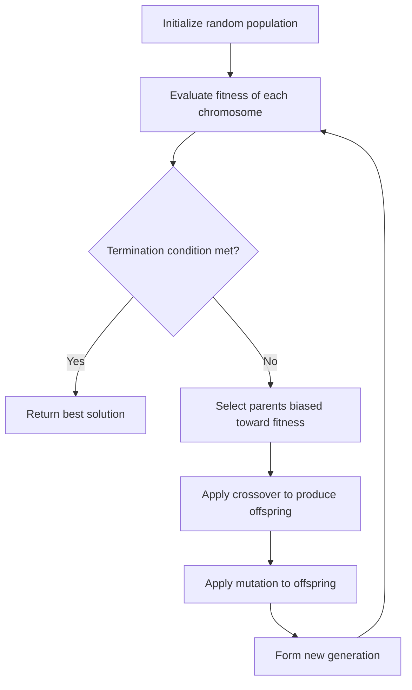

# Genetic Algorithms From Scratch

Implementing genetic algorithms from first principles in Python — starting with evolving strings from randomness, and progressing toward a reusable optimization framework.

---

## 🐒 Infinite Monkeys, Finite Patience

> *"If an army of monkeys were strumming on typewriters, they might write all the books in the British Museum."*
> — attributed to Sir Arthur Eddington

Give a monkey a typewriter and infinite time, and it will *eventually* type Shakespeare. Give a computer a population of random strings, a fitness function, and a little evolutionary pressure, and it'll type Shakespeare in about two seconds — no infinity required.

That's the joke this project starts with, and the idea it's actually built to disprove: **a genetic algorithm is not just a monkey typing faster.** It's what happens when you stop rewarding *random* monkeys and start rewarding the ones who are, however slightly, less wrong than the others. This repo begins with the monkey and ends up somewhere far more interesting.

---

## Why This Project Exists

This project is a hands-on exploration of genetic algorithms (GAs), inspired by Daniel Shiffman's *The Nature of Code* and the Infinite Monkey Theorem as a teaching device. The goal is to:

- Build a genetic algorithm **from scratch**, without relying on existing GA/evolutionary computation libraries.
- Understand the mechanics of evolutionary search deeply enough to explain and extend it, not just call a library function.
- Progress from a toy demonstration (target-string evolution) to a **general-purpose, reusable GA engine** applied to real combinatorial optimization problems.
- Document the reasoning, trade-offs, and experiments along the way, so the repository itself is a learning artifact and a portfolio piece.

This is not a tutorial repository meant to be read once and discarded. It's structured to grow — the target-string experiment is the entry point, not the destination.

---

## What Is a Genetic Algorithm?

A **Genetic Algorithm** is a search and optimization technique inspired by natural selection. Instead of exploring a solution space randomly forever, a GA maintains a *population* of candidate solutions and repeatedly biases that population toward better solutions using a small set of biologically-inspired operators.

The key vocabulary, used precisely throughout this project:

| Term | Meaning |
|---|---|
| **Gene** | A single unit of information in a candidate solution (e.g., one character, one item-inclusion flag). |
| **Chromosome / Genome** | A full candidate solution, made up of many genes (e.g., an entire candidate string). |
| **Population** | A collection of chromosomes that exist simultaneously at a given point in the search. |
| **Fitness function** | A function that scores how "good" a chromosome is at solving the problem — the only feedback the algorithm receives. |
| **Selection** | The process of choosing which chromosomes get to reproduce, biased toward higher fitness. |
| **Crossover** | Combining genetic material from two parent chromosomes to produce offspring. |
| **Mutation** | Randomly altering genes in a chromosome to introduce new variation and avoid stagnation. |
| **Generation** | One full cycle of evaluating, selecting, recombining, and mutating the population. |

### This is not brute force

A common misconception (that the Infinite Monkey framing can accidentally reinforce) is that a GA is just "random guessing, repeated." It isn't. Random search has no memory — every guess is independent of the last. A GA is different because of **selection**: chromosomes that perform better are more likely to pass their genes to the next generation. Over many generations, this creates *directional pressure* toward higher-fitness regions of the search space, while mutation and crossover keep the search from collapsing too early into a single, possibly suboptimal, solution.

In short: random search wanders. A genetic algorithm climbs.

---

## The Core Evolutionary Loop

Every genetic algorithm in this repository follows the same basic loop, regardless of the problem it's applied to:



The specific problem changes the genome representation, the fitness function, and possibly the operators — but the loop itself stays constant. That constancy is exactly what makes a GA implementation reusable across problems.

---

## Project Roadmap

This project is being built incrementally. The table below distinguishes what exists today from what is planned.

### 1. Target String / Infinite Monkey Experiment — *in progress*
- [ ] Random population initialization
- [ ] Character-match fitness function
- [ ] Selection mechanism
- [ ] Crossover operator
- [ ] Mutation operator
- [ ] Generational evolution loop and convergence to target string

### 2. General Genetic Algorithm Engine — *planned*
- [ ] Genome representation decoupled from the GA engine
- [ ] Configurable / pluggable fitness functions
- [ ] Pluggable selection strategies (roulette wheel, tournament, rank-based, etc.)
- [ ] Configurable crossover and mutation operators
- [ ] Reproducible experiments (seeded RNG, logged configuration)

### 3. Optimization Problems — *planned*
- [ ] Knapsack problem
- [ ] Scheduling / combinatorial optimization

### 4. Experiments — *planned*
- [ ] Mutation-rate analysis
- [ ] Population-size analysis
- [ ] Crossover-rate analysis
- [ ] Selection-strategy comparison
- [ ] Convergence behavior analysis
- [ ] Multi-seed statistical evaluation

### 5. Advanced Direction — *planned*
- [ ] Multi-objective optimization
- [ ] Pareto fronts
- [ ] NSGA-II

> **Note:** This project is at an early stage. No experiments, benchmarks, or general GA engine exist yet — the roadmap above reflects intended direction, not completed work. This section will be updated as each stage is implemented.

---

## Current Implementation Status

🚧 **Early stage.** The repository currently contains the initial setup for the target-string evolution experiment. No results, benchmarks, or general-purpose GA components have been implemented yet. Check back as commits land — this section will be kept up to date rather than describing aspirational functionality.

---

## Experiments and Results

No experiments have been run yet. Once the target-string experiment and general GA engine are implemented, this section will report:

- Convergence plots (fitness vs. generation)
- Effects of population size, mutation rate, and crossover rate
- Comparisons between selection strategies
- Statistical results averaged across multiple random seeds

Results will be added incrementally as they are produced — no placeholder numbers are included here.

---

## Repository Structure

```
genetic-algorithms-from-scratch/
├── README.md
├── requirements.txt
├── src/
│   ├── target_string/       # Infinite Monkey / target-string experiment
│   ├── ga_core/              # General, reusable GA engine (planned)
│   └── problems/             # Knapsack, scheduling, etc. (planned)
├── experiments/               # Experiment scripts and configs (planned)
├── notebooks/                 # Exploratory analysis (planned)
└── tests/
```

> This structure reflects the intended organization of the project and will evolve as components are implemented.

---

## Installation

```bash
git clone https://github.com/<your-username>/genetic-algorithms-from-scratch.git
cd genetic-algorithms-from-scratch
python -m venv venv
source venv/bin/activate  # On Windows: venv\Scripts\activate
pip install -r requirements.txt
```

---

## Usage

Once the target-string experiment is implemented, it will be runnable as a standalone script, for example:

```bash
python src/target_string/evolve.py --target "METHINKS IT IS LIKE A WEASEL" --population-size 200 --mutation-rate 0.01
```

*(Exact CLI arguments and defaults will be documented here once implemented.)*

---

## Example

Once functional, the target-string experiment will demonstrate a population converging on a target phrase over successive generations, with fitness improving monotonically (on average) as generations progress. A concrete example — including sample output and a generation-by-generation trace — will be added here once the implementation exists.

---

## Technical Concepts Learned

This section will be expanded as the project progresses. Planned areas of focus include:

- Representation design: encoding problems as genomes
- Fitness landscape design and its effect on convergence
- Exploration vs. exploitation trade-offs (mutation vs. selection pressure)
- Selection strategy design (roulette wheel, tournament, rank-based)
- Crossover operator design for different genome representations
- Premature convergence and diversity preservation
- Reproducibility in stochastic algorithms
- Multi-objective optimization and Pareto dominance (advanced stage)

---

## Future Work

- Extend beyond string genomes to permutation- and set-based genomes (knapsack, scheduling)
- Build out a proper experiment harness for statistical comparison across configurations
- Visualize convergence and population diversity over time
- Explore adaptive mutation/crossover rates
- Implement NSGA-II for multi-objective problems

---

## References

- Shiffman, D. — *The Nature of Code*, Chapter on Genetic Algorithms
- The Infinite Monkey Theorem (educational analogy, not a computational technique)
- Holland, J. H. — foundational work on genetic algorithms and adaptive systems
- Additional academic and practical references will be added as specific techniques (e.g., NSGA-II) are implemented and studied in depth.

---

*This README will be updated as the project evolves. Contributions, suggestions, and issue reports are welcome once the codebase is further along.*
